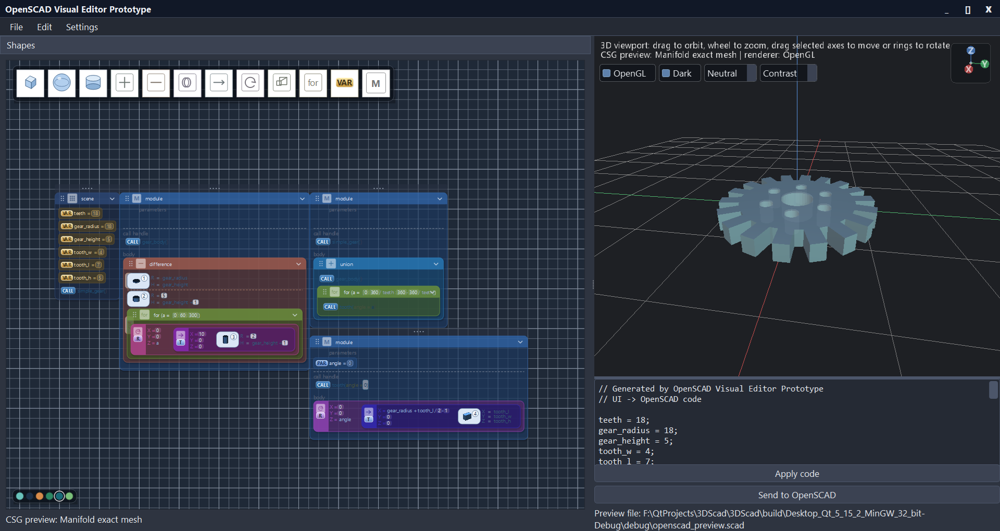

# OpenSCAD Visual Editor Prototype

Prototype of a visual editor for OpenSCAD-style modeling. The goal is a Tinkercad-like interface where UI actions update OpenSCAD code, and supported OpenSCAD code can be applied back into the visual scene.

## Preview



## Current State

The project is a Qt Widgets application using a custom `QOpenGLWidget` viewport. Rendering can use the software `QPainter` raster path or an OpenGL mesh path selected directly inside the viewport. CSG preview is computed asynchronously on a background thread so that loading complex parametric scenes (e.g. snowflake, gear, railway signal) never blocks the UI.

Implemented:

- Scene tree with cube, sphere, and cylinder primitives.
- Scene tree displays a permanent `scene` container plus top-level OpenSCAD `module` declarations.
- The document root is an internal non-deletable container; user geometry is placed in `scene`, while module declarations stay at root level.
- `SceneDocument` has an explicit tree-node hierarchy that is updated incrementally for add/delete/boolean-mode changes.
- The scene tree has a `VAR` node type for scene variables, module parameters, and module-local variables. Variables get unique names like `var1`, can be deleted, are emitted as OpenSCAD assignment lines or module parameters, and can drive supported primitive/transform expressions.
- Variable declarations preserve simple expression text such as `2*a+10-5`; supported expressions are syntax-checked and evaluated for tree rendering and preview.
- Group tree nodes store position, rotation, and scale transforms for transform-container editing.
- `SceneDocument` exposes group operations for add/remove/move, with undo/redo commands ready for UI wiring.
- The scene tree can create explicit `union`, `difference`, and `intersection` groups and move tree nodes between them.
- Experimental graphics tree preview based on `QGraphicsScene`, shown beside the classic tree.
- The graphics tree has an in-scene palette for cube, sphere, cylinder, union, difference, intersection, transform tools, `VAR`, and module tools.
- Graphics-tree drag/drop can add new primitives/groups and move existing tree nodes between groups with explicit insertion positions.
- Graphics-tree selection is synchronized with the classic tree, 3D viewport selection, and generated OpenSCAD code highlight.
- Graphics-tree `VAR` nodes display assignment expressions and allow direct `Ctrl` + mouse wheel adjustment of individual numeric literals.
- Graphics-tree primitives use shape icons plus stable object numbers instead of text-only cards.
- Graphics-tree groups use operation icons, nested panels, and dedicated `difference` base/cut regions with reserved cut-space even when empty.
- Graphics-tree live drag preview now shows future container expansion, source/target reserved slots, real toolbar-drop previews, and a snapshot of the moved node instead of a second temporary document node.
- Active graphics-tree drags use a green dashed focus outline: an ellipse for primitives and a rounded rectangle for group blocks.
- Graphics-tree move preview suppresses self-drop and removes the moved node from its source container preview while dragging.
- Graphics-tree supports `Delete`/`Backspace` for the selected tree node through the same undoable commands as the classic tree.
- The graphics tree uses a dark grid canvas with mouse panning and hidden scroll bars.
- Graphics-tree nodes use semi-transparent glass-like fills so the grid shows through; nested group depth is expressed through an HSV hue rotation (18° per level) applied to each operation's base colour.
- Four visual themes are available — Frost (cool mint), Glass (dark navy), Embers (warm amber), and Deep (emerald) — switchable from a circular swatch row at the bottom-left of the tree panel, styled like the viewport theme switcher.
- Drag-preview animation respects the active theme throughout: group cards, variable cards, and the drop-slot placeholder all use the current palette instead of resetting to Frost.
- The drop-slot placeholder shows the real name and expression of the node being moved (e.g. `radius = 15`) rather than the generic `var = 0` stub.
- Scene-tree context menus expose group creation plus shape/group deletion near the selected node.
- Scene-tree refreshes preserve selected groups when no primitive is selected.
- `difference()` and `intersection()` children are labeled in the tree so base/cut/mask roles are visible.
- The old Properties dock has been removed; supported primitive, transform, variable, for-loop, and module-call edits happen directly in the graphics tree or viewport.
- Selecting a group enables position/rotation editing for that group through undoable property changes.
- Selected primitives and groups can be moved from the viewport with axis gizmo arrows and rotated with the gizmo rings.
- Graphics-tree transform containers support `translate`, `rotate`, and `scale`; their compact controls can be adjusted with `Ctrl + mouse wheel`.
- Primitive size/radius/height controls are also exposed in the graphics tree and show viewport hints while editing.
- Module declarations have a non-code `call handle`. Dragging it creates a real `ModuleCall` node in `scene`, transform/boolean/for groups, or another module body; the handle itself remains in the declaration.
- `ModuleCall` nodes are selectable, highlighted in the viewport as specific call instances, adjustable through module parameter controls, movable, and deletable.
- Scene-tree drag/drop defers model updates until after Qt finishes the drop event to avoid transient disappearing rows.
- Moving nodes between groups preserves their world position for translation-only group transforms.
- OpenSCAD generation and Manifold CSG preview read the explicit document tree.
- OpenSCAD generation and Manifold CSG apply group transforms from the document tree.
- CSG preview detects boolean operations from the explicit tree, not only from legacy per-shape boolean flags.
- CSG preview also uses the explicit tree when group transforms are present, so transformed plain `union()` groups move as a unit.
- Shape properties for position, rotation, size, radius, height, and boolean mode.
- Undo/redo for add, delete, property changes, viewport drag, and code apply.
- OpenSCAD generation for the supported scene subset, with top-level variables, module declarations, explicit module calls, groups, transforms, for loops, and primitives.
- OpenSCAD generation includes variable declarations and module parameters, for example `var1 = 0;` or `module part(r = 10) { ... }`.
- OpenSCAD source mapping highlights the currently selected tree node in the code editor.
- Parser for the supported generated OpenSCAD subset, including variable assignment lines, module definitions with parameters, module calls, boolean groups, transform groups, for loops, and primitives.
- Interactive viewport orbit/zoom and right-button viewport panning.
- Depth-tested triangle rendering.
- In-viewport controls for OpenGL/software rendering, dark/light theme, and material color variants.
- OpenGL preview path with shaded solids, grid/axes, contact shadows, and configurable material palettes.
- Subtract helper objects render as Tinkercad-like translucent cut volumes: active cuts show useful silhouette/feature edges, while inactive cuts stay faint.
- Simple lights, material highlights, and fixed-size contact shadows.
- Shape picking in the viewport.
- Transform gizmo with X/Y/Z move axes and rotation rings.
- Boolean modes:
  - `Add solid`
  - `Subtract hole`
  - `Intersect mask`
- CSG preview status in the viewport and the left panel.
- Optional Manifold-backed exact mesh CSG preview when a local Manifold build is available.
- OpenSCAD preview bridge that writes `openscad_preview.scad` for live reload in OpenSCAD.

## CSG Preview

There are currently four preview modes:

- `plain mesh`: no boolean operation is active.
- `Manifold exact mesh`: real mesh boolean evaluation through the optional Manifold backend.
- `box mode`: real computed CSG for unrotated cubes.
- `mesh approximate`: approximate CSG for spheres, cylinders, and rotated cubes.

CSG preview is computed **asynchronously** on a background thread via `QFutureWatcher`. While a new result is being computed (e.g. right after loading a complex file), the viewport renders the last valid cached frame and the status line shows `CSG preview: computing…`. When the background result is ready the viewport refreshes automatically. This prevents the UI from freezing when loading scenes with many shapes or deep module hierarchies.

Manifold mode:

- Is used first when the matching local Manifold library exists at qmake time:
  `build/manifold-build-32/src/libmanifold.a` for 32-bit kits or
  `build/manifold-build-64/src/libmanifold.a` for 64-bit kits.
- Evaluates the scene boolean tree as mesh booleans.
- Falls back to the internal box/mesh preview if Manifold is not built or returns an invalid result.

Box mode:

- Works with unrotated cubes.
- Computes subtract and intersect operations as box volume operations.
- Builds a surface mesh from occupied cells.
- Removes internal faces.
- Merges coplanar face cells into larger rectangles.

Mesh approximate mode:

- Works as a first preview for non-box shapes.
- Filters triangles by centroid against subtract/intersect helper volumes.
- Adds approximate subtract cut faces for some helper shapes, but is not a robust boolean solver.

During drag, CSG evaluation is paused and the viewport shows a lightweight interaction preview. Full CSG preview recomputes after the drag is finished.

## Build

This is a Qt `.pro` project.

Known working setup:

- Qt 5.15.2
- MinGW 32-bit or 64-bit
- qmake project: `3DScad.pro`

Typical build from Qt Creator should work. From the existing debug build directory, the project has been verified with:

```powershell
qmake ..\..\3DScad.pro -spec win32-g++ "CONFIG+=debug" "CONFIG+=qml_debug"
mingw32-make -f Makefile.Debug
```

Optional Manifold CSG backend:

```powershell
.\scripts\build-manifold.ps1
qmake 3DScad.pro
mingw32-make
```

Use `.\scripts\build-manifold.ps1 -Arch 32` for a 32-bit Qt kit or
`.\scripts\build-manifold.ps1 -Arch 64` for a 64-bit Qt kit. The default is 64-bit.

There is also a small GUI wrapper at `tools/manifoldbuilder` for running the
same Manifold build script without typing the PowerShell command. See
[docs/manifoldbuilder.md](docs/manifoldbuilder.md).

With Qt's MinGW GCC 8, current Manifold may require local sequential fallbacks in `build/manifold-src/src/parallel.h` for `std::reduce`, `std::inclusive_scan`, and `std::exclusive_scan`.

The in-viewport `OpenGL` checkbox enables the optional experimental viewport backend. In this mode solid scene meshes, grid/axes, and contact shadows are drawn through OpenGL shader paths with depth testing. Gizmos, helper overlays, text, CPU-side projection, and the pick buffer still reuse the existing software path, so large performance gains are not expected yet.

## Sample Scenes

A collection of ready-made parametric OpenSCAD scenes is included under
`docs/sample_codes/`. Each file uses only the round-trippable command subset so
the scene can be loaded, edited visually, and written back as code. Examples
include mechanical parts (pulley, pipe flange, fan, gear), furniture
(armchair, dining table, bookshelf), architecture (castle tower, Japanese
pagoda, spiral staircase), and decorative models (Saturn, snowflake, space
station, railway signal).

## Distribution — Portable Build

`tools/sfxbuilder` is a GUI tool that packs a compiled Windows `.exe` into a
single self-extracting portable executable using `windeployqt` + 7-Zip SFX. It
handles Qt DLLs, MinGW runtime DLLs (`libgcc_s_seh-1.dll`, `libstdc++-6.dll`,
`libwinpthread-1.dll`), and an optional extra-files bundle (e.g.
`docs/sample_codes`).

See [docs/sfxbuilder.md](docs/sfxbuilder.md) for full usage instructions.

## Supported OpenSCAD Subset

The visual tree is intentionally round-tripped through a small OpenSCAD subset:
top-level scene variables, top-level module declarations, explicit module calls,
boolean groups, transform groups, for loops, and cube/sphere/cylinder
primitives. Module declarations do not create geometry by themselves; use the
module card's non-code call handle in the graphics tree, or write an explicit
`module_name(...);` call in supported code.

See [docs/openscad_subset.md](docs/openscad_subset.md) for the current syntax
contract and known limitations for correct tree reconstruction.

## Limitations

- The OpenGL viewport path is still experimental and mixed with QPainter overlays; it does not yet use persistent VBO/index buffers or GPU picking.
- OpenSCAD parser supports only the generated subset, but `Apply code` now restores the explicit tree structure for supported generated code instead of flattening back to shapes only.
- Variables and module parameters support simple arithmetic expressions, but the UI still has no rename flow and the scope model is intentionally smaller than full OpenSCAD.
- Manifold is currently an optional local build, not a vendored/submodule dependency.
- Mesh approximate fallback is not exact.
- Box CSG only handles axis-aligned cubes.
- No export pipeline yet.
- The graphics tree is still a prototype: it coexists with the classic tree and its toolbar is intentionally embedded in the scene for experimentation.
- Shape boolean mode is still present as a legacy/simple editing control and can rewrite primitive placement in the explicit tree.

## Next Good Steps

1. Formalize Manifold dependency setup: submodule, bootstrap script, or CMake migration.
2. Refine graphics-tree editing: rename groups, add explicit reorder affordances, keep improving difference base/cut behavior, and decide when the classic tree can be hidden.
3. Move the experimental OpenGL backend toward persistent vertex/index buffers and GPU picking.
4. Add OpenSCAD CLI integration for validation/export.
5. Improve parser into an AST-based roundtrip layer.
